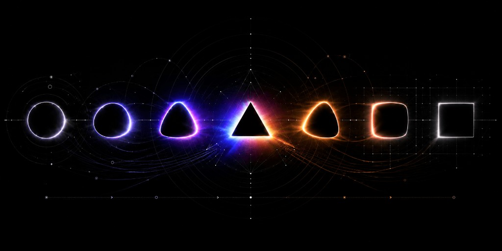

<p align="center">
  
</p>

# ▲ phase

Lifecycle-aware animation infrastructure for the web.

## Table of contents

- [Install](#install)
- [Quick start](#quick-start)
- [Philosophy](#philosophy)
- [Scope](#scope)
- [Entry points](#entry-points)
- [Core API](#core-api)
  - [createLoop](#createloop)
  - [createTicker](#createticker)
  - [createSight](#createsight)
  - [prefersReducedMotion](#prefersreducedmotion)
- [Easing and math](#easing-and-math)
- [React hooks](#react-hooks)
  - [useLoop](#useloop)
  - [useCanvas](#usecanvas)
  - [useTween](#usetween)
  - [usePresence and Presence](#usepresence-and-presence)
  - [Swap](#swap)
  - [Utility hooks](#utility-hooks)
- [Guarantees](#guarantees)
- [Errors](#errors)

## Install

```bash
pnpm add phase
```

## Quick start

```tsx
import { useLoop } from 'phase/react';

function Orbit({ radius }) {
  const speed = 1; // radians per second
  const { ref } = useLoop({
    onTick: (frame) => {
      const angle = (frame.elapsed / 1000) * speed;
      ref.current.style.transform = `translate(${Math.cos(angle) * radius}px, ${Math.sin(angle) * radius}px)`;
    },
  });

  return <div ref={ref} className="dot" />;
}
```

That's it. Behind those four lines:

- **Pauses itself when invisible** — scrolled off-screen or background tab, zero CPU consumed
- **Respects reduced motion by default** — accessibility is not an afterthought
- **Resumes without skipping a beat** — no teleporting, no lost animation time
- **Clean teardown** — unmount and walk away, nothing leaks

Visibility, reduced motion, frame timing, quality signals, teardown. Handled. The rest of this README explains how.

## Philosophy

### The name

A **phase** is the state something is in at any given moment. Idle. Running. Paused. Entering. Exiting. Every animation primitive in this package models its lifecycle as a phase. A single string that tells you exactly where things stand.

### Phases and reasons

Every phase transition carries a **reason** — a string constant explaining _why_ the transition happened.

```ts
const { phase, reason } = useLoop({ ref, onTick: draw });

// phase: 'paused'  reason: 'sight'           → off-screen
// phase: 'paused'  reason: 'reduced-motion'  → user disabled motion
// phase: 'running' reason: 'resumed'         → came back into view
```

One string replaces six booleans. No decoding `if (running && visible && !paused && !prefersReducedMotion && mounted)`. The phase _is_ the answer.

### The safe path is the easy path

Visibility awareness, reduced motion, observer cleanup, delta clamping, these are not opt-in features you add later. They are the default behavior. The only way to bypass reduced motion is an explicit, reviewable `reducedMotion: 'ignore'` in the diff. The only way to leak an observer is to never call `stop()`. Phase makes it harder to ship the wrong thing than the right thing.

### Intent

Phase provides the infrastructure to build world-class animations: lean, small, fast, and intentionally scoped. You bring the creative vision. Phase handles the lifecycle underneath: the timing, the pausing, the resuming, the cleanup, the signals. Skip the boilerplate and edge cases. Get straight to the work that matters.

## Scope

Phase is the infrastructure layer underneath all animation approaches. It composes signals (visibility, focus, reduced motion, frame budget) into a single coherent lifecycle, gives you a reason for every state transition, and makes the safe behavior automatic.

**Phase handles:** lifecycle state management, timing infrastructure, visibility awareness, reduced motion, observer pooling, quality signals, frame loop management.

**Phase does not handle:** spring physics, gesture systems, declarative keyframe orchestration, scroll-linked animation.

When your animation needs its own physics engine or gesture recognizer, reach for a dedicated library built for that.

## Entry points

| Import        | Contents                                                               |
| ------------- | ---------------------------------------------------------------------- |
| `phase`       | Core primitives: createLoop, createTicker, createSight, easing, errors |
| `phase/ease`  | Easing functions and math utilities only                               |
| `phase/react` | React hooks and components                                             |

Each entry point is independently tree-shakeable. Importing `phase/ease` in a server component pulls zero browser APIs.

## Core API

### createLoop

The main primitive. Composes a ticker, visibility observer, and reduced-motion listener into a single lifecycle-aware animation loop.

```ts
import { createLoop } from 'phase';

const loop = createLoop({
  element: el,
  onTick: (frame) => {
    // frame.time    — performance.now()
    // frame.delta   — ms since last tick (clamped to 40ms)
    // frame.elapsed — ms since start (paused time excluded)
    // frame.frame   — frame count
  },
});

loop.start();
// loop.phase  === 'running'
// loop.reason === 'started'
```

#### Loop phases

| Phase     | Meaning                          | Possible reasons                                     |
| --------- | -------------------------------- | ---------------------------------------------------- |
| `idle`    | Created but not started          | `initial`                                            |
| `running` | Actively ticking                 | `started`, `resumed`                                 |
| `paused`  | Temporarily stopped, will resume | `sight`, `reduced-motion`, `enabled`, `context-lost` |
| `stopped` | Permanently disposed             | `manual`, `disposed`                                 |

#### Loop options

| Option          | Type                                | Default   | Description                               |
| --------------- | ----------------------------------- | --------- | ----------------------------------------- |
| `element`       | `Element`                           | required  | Element to observe for visibility         |
| `onTick`        | `(frame: FrameState) => void`       | required  | Called each frame while running           |
| `fps`           | `number`                            | —         | Cap frames per second                     |
| `reducedMotion` | `'pause' \| 'complete' \| 'ignore'` | `'pause'` | Behavior when user prefers reduced motion |
| `onPhaseChange` | `(phase, reason) => void`           | —         | Called on every phase transition          |

### createTicker

The low-level rAF clock underneath `createLoop`. Use directly when you need a frame loop without visibility management: background processing, audio sync, or non-visual timing.

```ts
import { createTicker } from 'phase';

const ticker = createTicker({
  onTick: (frame) => {
    /* runs every frame */
  },
  fps: 30,
});
ticker.start();
```

All tickers share a single `requestAnimationFrame` loop. Every subscriber reads the same `performance.now()` value each frame. Mo visual desync between independent animations.

#### Ticker phases

| Phase     | Meaning                  | Transitions                 |
| --------- | ------------------------ | --------------------------- |
| `idle`    | Created, not started     | → `running` via `start()`   |
| `running` | Actively ticking         | → `paused` via `pause()`    |
| `paused`  | Suspended, resumable     | → `running` via `resume()`  |
| `stopped` | Terminal, cannot restart | via `stop()` from any state |

### createSight

Answers one question: can the user see this element right now? Combines three signals — `document.visibilitychange`, `pageshow` (bfcache restore), and `IntersectionObserver` — into a single phase.

```ts
import { createSight } from 'phase';

const sight = createSight({
  element: el,
  onPhaseChange: (phase, reason) => {
    // phase:  'visible' | 'hidden' | 'unknown'
    // reason: 'viewport' | 'document' | 'bfcache' | 'both' | 'initial'
  },
});
```

Phase is `'visible'` only when **both** the document is focused AND the element is in the viewport. Uses pooled `IntersectionObserver` — 20 elements with the same options share one observer instance.

### prefersReducedMotion

A reactive check that returns `true` when the user has enabled reduced motion at the OS level. Use it to gate expensive setup or dynamic imports.

```ts
import { prefersReducedMotion } from 'phase';

if (!prefersReducedMotion()) {
  const { startParticleSystem } = await import('./particles');
  startParticleSystem(canvas);
}
```

All hooks and primitives consult this signal automatically. You only need it directly for conditional imports or setup logic.

## Easing and math

Pure functions. No browser APIs, no side effects, no React. Safe anywhere — server components, build scripts, tests.

```ts
import { lerp, clamp01, easeOutCubic, remap } from 'phase/ease';
```

### Easing functions

| Function         | Character                       |
| ---------------- | ------------------------------- |
| `easeOutCubic`   | Fast start, smooth deceleration |
| `easeOutQuart`   | Sharper deceleration            |
| `easeOutBack`    | Overshoots target, snaps back   |
| `easeInOutCubic` | Symmetric S-curve               |
| `linear`         | No easing (identity)            |

All easing functions take a progress value (0–1) and return a curved progress value (0–1). They don't know about time, pixels, or anything else — they reshape a number.

### Math utilities

| Function                         | Description                    | Example                            |
| -------------------------------- | ------------------------------ | ---------------------------------- |
| `clamp(value, min, max)`         | Constrain to range             | `clamp(150, 0, 100)` → `100`       |
| `clamp01(value)`                 | Constrain to 0–1               | `clamp01(-0.5)` → `0`              |
| `lerp(start, end, t)`            | Linear interpolation           | `lerp(0, 100, 0.5)` → `50`         |
| `inverseLerp(start, end, value)` | Where is value in range? (0–1) | `inverseLerp(0, 100, 75)` → `0.75` |
| `remap(options)`                 | Map from one range to another  | Input range → output range         |

### The pattern

```ts
const progress = clamp01(elapsed / duration); // normalize time to 0–1
const eased = easeOutCubic(progress); // reshape the curve
const value = lerp(startPos, endPos, eased); // map to your range
```

Easing, interpolation, and your value range are three separate concerns. Phase keeps them separate so you can mix and match.

## React hooks

### useLoop

The primary React hook. Wraps `createLoop` with React lifecycle management.

```tsx
import { useLoop } from 'phase/react';

const { ref, phase, reason } = useLoop({
  onTick: (frame) => {
    ref.current.style.transform = `translateX(${frame.elapsed * 0.1}px)`;
  },
});
```

Your `onTick` callback always sees the latest values from your component — props, state, other refs — without restarting the loop. Internally, the callback is stored via `useSyncedRef` so its identity never matters.

**The cardinal rule: never call `setState` inside `onTick`.** The callback runs 60 times per second. Write to refs or the DOM directly. The only re-render trigger is `phase` changing — an infrequent lifecycle event.

### useCanvas

Everything `useLoop` provides, plus canvas-specific infrastructure: DPR-aware buffer sizing, ResizeObserver coalescing, and GPU context loss recovery.

```tsx
import { useCanvas } from 'phase/react';

const { containerRef, canvasRef, phase } = useCanvas({
  onDraw: (ctx, frame, size) => {
    ctx.clearRect(0, 0, size.width, size.height);
    // ctx is already scaled for devicePixelRatio — draw in CSS pixels
  },
});
```

| Concern      | How useCanvas handles it                                                               |
| ------------ | -------------------------------------------------------------------------------------- |
| DPR (retina) | Reads `devicePixelRatio`, listens for changes. Buffer sized at `width * dpr`.          |
| Resize       | Shared ResizeObserver. Canvas resized on container change. No `getBoundingClientRect`. |
| Context loss | Listens for `contextlost`/`contextrestored`. Pauses on loss, recovers on restore.      |
| Quality      | When degraded, DPR drops to 1x automatically (halves GPU pixel count).                 |

### useTween

Animates a number from A to B over a duration. The one hook that intentionally calls `setState` per frame — because the consumer needs the animated value in render output.

```tsx
import { useTween } from 'phase/react';

const opacity = useTween({ target: isVisible ? 1 : 0, duration: 300 });
```

Use `useTween` for single values where the render is cheap (counters, progress bars, opacity). Use `useLoop` when animating many elements or doing canvas work — per-frame `setState` doesn't scale.

Reduced motion default: `'complete'` — jumps instantly to target. A toggle should reach its destination; it just shouldn't animate getting there.

### usePresence and Presence

The missing piece between CSS animations and React unmounting. CSS `@starting-style` handles enter, but exit animations require JS to defer unmounting until the animation completes.

```tsx
import { usePresence } from 'phase/react';

const { ref, phase, mounted } = usePresence({
  show: isOpen,
  exitDuration: 300,
});
```

#### Presence phases

`idle` → `entering` → `entered` → `exiting` → `exited`

The `<Presence>` component wraps this into a `div` that stamps `data-phase` automatically. Style with CSS:

```tsx
import { Presence } from 'phase/react';

<Presence
  show={isOpen}
  className="transition-all duration-300
    data-[phase=entering]:opacity-0 data-[phase=entering]:translate-y-4
    data-[phase=exiting]:opacity-0 data-[phase=exiting]:scale-95"
>
  Content slides up on enter, shrinks on exit
</Presence>;
```

#### Two modes

| Mode       | Behavior                                           | Use case                                 |
| ---------- | -------------------------------------------------- | ---------------------------------------- |
| `'mount'`  | Added to DOM on show, removed after exit completes | Modals, toasts, menus                    |
| `'reveal'` | Always in DOM, visibility toggled via phase        | Scroll reveals, SEO content, IO re-entry |

### Swap

Coordinated exit-then-enter transitions. The old state fully exits before the new state enters. No overlap, no z-index fighting.

```tsx
import { Swap } from 'phase/react';

<Swap active={success ? 'success' : 'form'}>
  <Swap.State
    id="form"
    className="transition-all data-[phase=exiting]:opacity-0"
  >
    <Form />
  </Swap.State>
  <Swap.State
    id="success"
    className="transition-all data-[phase=entering]:opacity-0"
  >
    <SuccessMessage />
  </Swap.State>
</Swap>;
```

Rapid changes (A → B → C during A's exit) skip intermediate states and advance directly to the latest `active`.

### Utility hooks

| Hook                | Purpose                                              |
| ------------------- | ---------------------------------------------------- |
| `useSight`          | Element visibility as a phase (`visible` / `hidden`) |
| `useSize`           | Element dimensions via shared ResizeObserver         |
| `useContainerQuery` | Breakpoint matching against element width            |
| `useMediaQuery`     | CSS media query subscription (shared MQL pool)       |
| `useSyncedRef`      | Ref always in sync with latest value                 |
| `useStableCallback` | Stable-identity function that calls latest closure   |

## Guarantees

Phase makes the following engineering commitments. These are tested invariants, not aspirations.

### Zero per-frame allocations

`FrameState` is created once and mutated in place every frame. No objects, arrays, closures, template literals, or spread operators in the tick path. No GC pressure at 60fps.

### Strong pause

When paused, the ticker calls `cancelAnimationFrame` and stops scheduling entirely. Zero callbacks fire. Zero CPU consumed. The browser doesn't even wake the code. This is not the "weak pause" pattern of scheduling rAF and returning early.

### Zero forced reflows

No `getBoundingClientRect()`, `offsetWidth`, `scrollWidth`, or `getComputedStyle()` anywhere in the package. All dimensions come from ResizeObserver (async, compositor-aligned). All visibility comes from IntersectionObserver.

### Zero React re-renders from the frame loop

The rAF loop never triggers a React re-render. All per-frame state lives in refs. `onTick` writes to refs or DOM directly. The only re-render trigger is `phase` changing — an infrequent lifecycle transition.

### Frame-locked shared clock

All tickers share one `requestAnimationFrame` loop with a single `performance.now()` read per frame. Multiple animations on the same page stay in visual sync.

### Delta clamping

When a loop resumes after a pause, `frame.delta` is clamped to 40ms. Animations resume smoothly from where they left off — no teleporting across the screen after a long background.

## Errors

Phase uses structured errors via `@vercel/error`. Every error includes a machine-readable code and an actionable message.

```ts
import { PhaseError, isPhaseError } from 'phase';
```

| Code                   | Trigger                                     |
| ---------------------- | ------------------------------------------- |
| `server_context`       | Calling a browser-only primitive during SSR |
| `no_element`           | Required element ref is null                |
| `sight_disposed`       | Interacting with a stopped sight instance   |
| `invalid_duration`     | Duration is negative or NaN                 |
| `ticker_stopped`       | Calling start/resume on a stopped ticker    |
| `presence_no_children` | `<Presence>` rendered without children      |
| `missing_context`      | `<Swap.State>` used outside `<Swap>`        |
